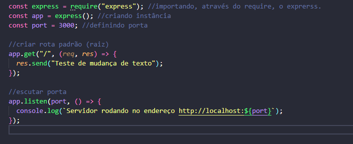
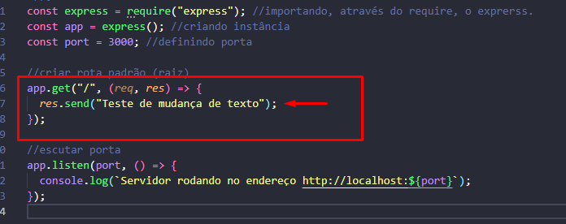
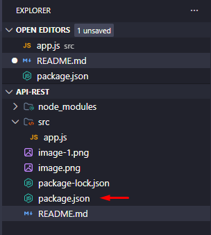
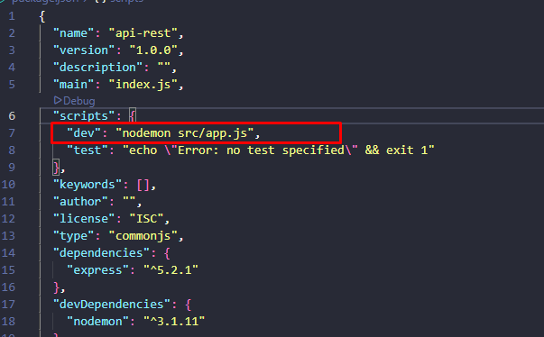

# Anotações

## Rodar o servidor:

No começo desse projeto, para rodar o servidor, eu usei essa parte do código:

O problema de depender apenas desse arquivo para rodar o servidor é ruim, porque qualquer mudança que a gente nessa parte aqui:

para ver a mudança acontecendo na web, é necessário derrubar a conexão com o servidor dando CTRL + C no terminal.
Para evitar esse trabalho toda vez que a gente faz alguma edição, nós devemos instalar o **nodemom** dessa forma:
_npm install nodemon -D_

Feito a instalação, nós vamos agora no arquivo package.json:

onde foi feito a instalação do mesmo com:
_npm init -y_

E criamos um novo script nessa parte do código:

colocando o nome **nodemon** e o caminho que esse cara vai executar o arquivo principal.
Com tudo isso feito, agora podemos FINALMENTE utilizar a famosa linha para ativar um servidor com mais facilidade:
_npm run dev_

dev porque o nome do script que a gente deu foi dev, e a execução dele é rodar o **nodemon** e o caminho do arquivo 👍

E para encerrar é só dar CTRL + C
